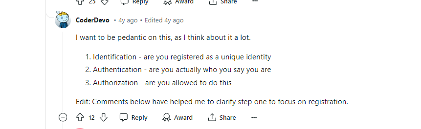
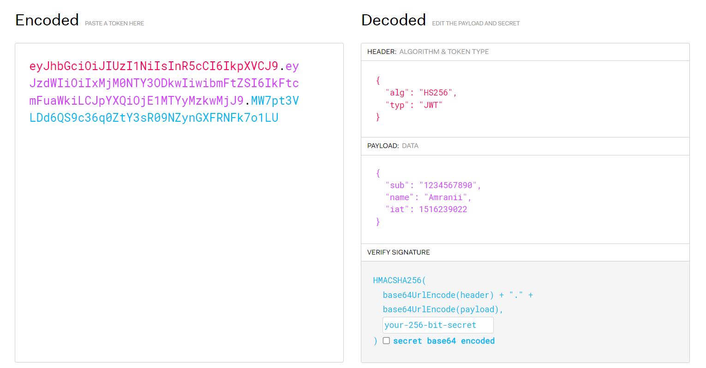

# JSON Web Tokens (JWT) – la seule explication dont vous aurez besoin

>[!NOTE]
> ## Content:
> - [Qu'est-ce que JWT ?](#quest-ce-que-jwt-)
> - - [Difference entre Authentification et Autorisation](#difference-entre-authentification-et-autorisation)
> - - [Pourquoi avons-nous besoin de jetons Web JSON (JWT) ?](#pourquoi-avons-nous-besoin-de-jetons-web-json-jwt)
> - [L'avantage des JWT est qu'ils sont stateless ?](#lavantage-des-jwt-est-quils-sont-stateless-)
> - [Comment fonctionne JWT ?](#comment-fonctionne-jwt-)
> - [Conclusion](#conclusion)
> - [Ressource](#ressource)
> - [Let’s Get in Touch](#lets-get-in-touch)
> - Exemple de JWT on Postman

## Qu'est-ce que JWT ?

## Difference entre Authentification et Autorisation:
> **Authentification** : C'est le processus par lequel un utilisateur prouve qu'il est bien celui qu'il prétend être. Par exemple, en fournissant un nom d'utilisateur et un mot de passe.

> **Autorisation** : C'est le processus par lequel un utilisateur est autorisé à accéder à certaines ressources. Par exemple, un utilisateur authentifié peut être autorisé à accéder à certaines pages d'un site web.

> ## Pourquoi avons-nous besoin de jetons Web JSON (JWT) ?
> Les sessions sont une méthode traditionnelle d'authentification et d'autorisation. Cependant, elles ne sont pas idéales pour les applications modernes. Les sessions nécessitent un stockage côté serveur, ce qui peut être coûteux en termes de ressources. De plus, elles ne sont pas idéales pour les applications décentralisées et nécessitant une scalabilité élevée.

> ### JWT, ou JSON Web Token, ou JWT  `/dʒɒt/` (“jot”), est un standard ouvert pour créer des jetons d'accès sécurisés. Il est utilisé pour transmettre des informations entre deux parties de manière sécurisée et compacte.
> #### Un JWT est composé de trois parties : l'en-tête, le payload et la signature.

1. **Header (En-tête)** : Contient le type de jeton (JWT) et l'algorithme de cryptage utilisé.
2. **Payload (Charge utile)** : Contient les informations (ou claims) que nous souhaitons transmettre, comme l'identifiant de l'utilisateur.
3. **Signature** : Assure l'intégrité du token. Elle est générée en combinant l'en-tête et la charge utile avec une clé secrète.

# L'avantage des JWT est qu'ils sont stateless ?

> ### L'avantage des JWT est qu'ils sont stateless, ce qui signifie que le serveur n'a pas besoin de conserver d'informations sur l'utilisateur entre les requêtes. Le jeton lui-même contient toutes les informations nécessaires

# Comment fonctionne JWT ?

1. **Connexion** : L'utilisateur envoie ses identifiants 
(nom d'utilisateur et mot de passe).

2. **Génération du token** : Si les identifiants sont corrects, le serveur génère un JWT et le renvoie au client.

3. **Stockage** : Le client stocke ce token (généralement dans le local storage ou les cookies).

4. **Requêtes Authentifiées** : Pour chaque requête nécessitant une authentification, le client envoie le token dans l'en-tête de la requête.

5. **Vérification** : Le serveur vérifie la validité du token et autorise ou refuse l'accès.

# Conclusion
> JWT sont idéaux pour les applications modernes, décentralisées et nécessitant une scalabilité élevée. Les sessions, quant à elles, sont simples et sécurisées pour des applications plus traditionnelles.

# Useful Resources :

- [JWT.io](https://jwt.io/)
- Exemple de JWT : [JWT.io](https://jwt.io/#debugger-io)
- [JWT Handbook](https://auth0.com/resources/ebooks/jwt-handbook)
- [Difference entre Authentification et Autorisation](https://www.reddit.com/r/node/comments/fzrto2/authentication_and_authorization_are_often_used/)
- [more explanation about JWT](https://arielweinberger.medium.com/json-web-token-jwt-the-only-explanation-youll-ever-need-cf53f0822f50)

# Let’s Get in Touch
- [http://Amranii](https://x.com/Amr4nii)
- el_amranii@outlook.com